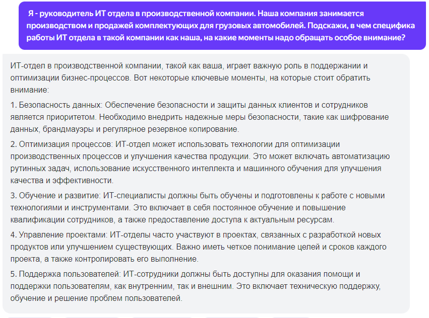
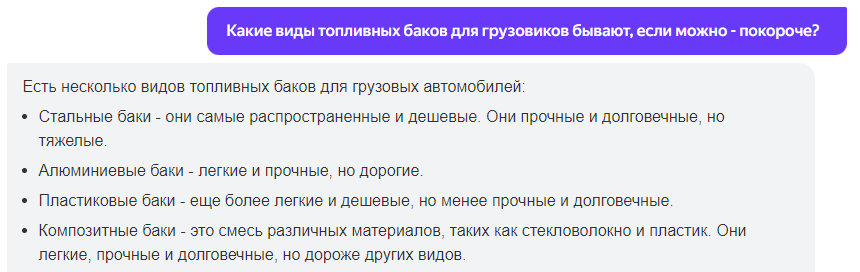
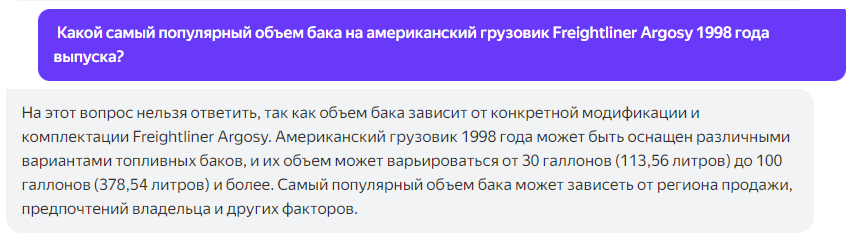

# Введение в искусственный интеллект

## Домашнее задание к Семинару 1
_Криволапов Антон_

### Урок 1. Историческая справка об искусственном интеллекте

> Необходимо составить отчет. Сдавать либо как файлом форматом PDF или DOCX, либо как ссылку на гитхаб с документом .md
> 
> Выберите для общения два любых чат-бота с искуственным интеллектом, но обязательно один из них разработан в РФ.
> 
> Получить доступ к ChatGPT можно черезе Edge -> BING, но включив VPN. Как вариант в телеграмме https://t.me/GPT_chat_robot, но это будет не самая новая версия.
> 
> Опишите в отчете выбранные чат-боты, особенности и различия их работы.
> 
> Опишите в отчете свою сферу деятельности.
>
> Поспрашивайте у чат-ботов о самых каверзных моментах своей работы, о сложных технических деталях. В отчете приложите скрины основных моментов общения.
>
> Опишите в таблице где и и как можно применить чат-боты, какие существуют риски, какое оборудование нужно, какой экономический эффект это даст предприятияю.
>
> Оцените этические и правовые проблемы такого использования.

## Для исследования я выбрал два чат-бота:
- GPT в Telegram (https://chatsgpts.io/). Проект создан энтузиастами технологии OpenAI и не является официальным представителем компании. Заявлено, что работает на технологиях  GPT-3.5 и GPT-4.
- YandexGPT 2 (https://ya.ru/ai/gpt-2) как пример российского чат-бота (надеюсь).

## Моя сфера деятельности  

Я - руководитель ИТ отдела в производственной компании. Наша компания занимается производством и продажей комплектующих для грузовых автомобилей:
- Топливные баки
- Гидравлические баки
- Радиаторы
- Турбины
- Паллетные ящики
- Корзины для колес

## Общение с ботами
Пообщаемся с ботами на одни и те же темы и сравним результаты:
### GPT в Telegram
_Привет!_

> Привет! Чем я могу помочь тебе сегодня?

_Расскажи о себе_

> Привет! Я - искусственный интеллект, созданный для помощи в решении различных задач. У меня нет личности или физического существования, я просто компьютерная программа, которая обрабатывает информацию и предоставляет ответы на вопросы. Моя цель - помогать людям найти нужную информацию и решить их проблемы. Надеюсь, что моя помощь будет полезной для тебя!

_Кто тебя создал_
 
> Я был создан командой разработчиков и инженеров в компании, которая специализируется на разработке искусственного интеллекта и чат-ботов. Моя разработка требует множества знаний в области алгоритмов, машинного обучения, обработки естественного языка и других технологий. Надеюсь, что моя работа приносит пользу пользователям и помогает им в решении их вопросов.

_Я - руководитель ИТ отдела в производственной компании. Наша компания занимается производством и продажей комплектующих для грузовых автомобилей. Подскажи, в чем специфика работы ИТ отдела в такой компании как наша, на какие моменты надо обращать особое внимание?_

> Привет! Работа ИТ отдела в производственной компании, занимающейся продажей комплектующих для грузовых автомобилей, имеет свои особенности. Некоторые ключевые аспекты, на которые стоит обратить особое внимание, включают:
> 1. Интеграция систем: Обеспечение эффективной работы различных информационных систем, таких как системы управления производством, складского учета и управления заказами, чтобы обеспечить плавный и автоматизированный процесс производства и продажи.
> 2. Кибербезопасность: Защита компании от киберугроз и утечек конфиденциальных данных, особенно учитывая важность защиты интеллектуальной собственности и коммерческой тайны.
> 3. Мониторинг оборудования: Оптимизация производственных процессов через мониторинг и поддержание работоспособности технического оборудования.
> 4. Внедрение новых технологий: Использование инноваций, таких как интернет вещей (IoT), машинное обучение и аналитика данных для оптимизации производственных процессов и повышения эффективности работы компании.
> 5. Поддержка пользователей: Обеспечение бесперебойной работы информационных систем и оказание необходимой технической поддержки для сотрудников компании.
> 
> Работа ИТ отдела в производственной компании играет важную роль в обеспечении бесперебойной и эффективной работы бизнеса. Надеюсь, эти рекомендации помогут вам в повышении эффективности работы вашего отдела. Если у вас есть какие-либо конкретные вопросы или потребности, не стесняйтесь обращаться за помощью.

_Уточни, а в чем именно состоит особенность работы ИТ отдела в компании, которая производит детали для грузовых автомобилей, от, например, компании, которая делает детали для легковых автомобилей?_

> Специфика работы ИТ отдела в компании, производящей детали для грузовых автомобилей, может отличаться от работы в компании, выпускающей комплектующие для легковых автомобилей, по следующим причинам:
> 1. Масштаб производства: Производство деталей для грузовых автомобилей обычно требует большого масштаба и объемов производства, что означает более сложную организацию производственных процессов и управления ими.
> 2. Специфика деталей: Детали для грузовых автомобилей часто имеют более высокие требования к прочности, надежности и безопасности, поэтому требуется более точное и строгое контролирование качества производства.
> 3. Логистика и интеграция: Производство деталей для грузовых автомобилей связано с более сложной логистикой и интеграцией с другими производственными процессами, такими как сборка грузовиков и управление запасами.
> 4. Технические особенности: Для производства деталей для грузовых автомобилей могут потребоваться специальные технологии и оборудование, такие как техника для грузоподъемных работ или специализированные машины.
> 
> ИТ отдел в компании, производящей детали для грузовых автомобилей, должен учитывать эти особенности и обеспечить эффективное функционирование информационных систем и технологий, чтобы поддержать производственные процессы и обеспечить успех бизнеса. Надеюсь, что эти различия помогли вам понять специфику работы ИТ отдела в вашей компании. Если у вас есть еще какие-то вопросы, не стесняйтесь обращаться.

_Какие виды топливных баков для грузовиков бывают, если можно - покороче?_

> Для грузовиков используются преимущественно прямоугольные баки, цилиндрические баки и баки-герметики.

_На какой объем изготавливаются  топливные баки для грузовиков?_

> Топливные баки для грузовиков могут иметь различный объем, в зависимости от типа грузовика, его грузоподъемности и целей использования. Обычно объем топливных баков для грузовиков составляет от 100 до 1000 литров, однако встречаются и баки с большим объемом, например, до 1500 или 2000 литров.

_What is the most popular tank size for American truck Freightliner Argosy 1998 year?_

> The most common fuel tank size for the American truck Freightliner Argosy from 1998 is around 120 to 150 gallons, although there may be variations depending on the specific model and configuration of the vehicle.
---
В принципе, видно, что чат-бот отлично понимает текст как на русском языке, так и на английском.

Ответы даются достаточно размытыми, но, тем не менее они отлично подходят, например, для использования в текстах. Ответы выдаются довольно развернутые, но бот можно попросить сократить ответ, в том числе, указав примерное количество слов (я проверял это на школьных сочинениях).

Также на конкретный вопрос бот дает конкретный ответ с цифрами (данными по объему баков). 

Я достаточно давно использую этот бот для написания текстов для сайта, составления программ на python, а также для решения школьных задач для моих детей. Да, да, он не только решает школьные задачи, но и выдает ответ с пояснениями хода решения.

Также при составлении программ на python мне предлагались достаточно косячные программы, которые сразу выдавали ошибки. Но на эти ошибки можно указать боту (GPT в ТГ), он извиняется и выдает откорректированный результат, и, после некоторых итераций можно получить более-менее годный кусок кода. Но это неспециализированные боты, которые могут отвечать на широкий круг вопросов. Думаю существуют более специализированные боты, которые больше разбираются в узких направлениях, там более что они все более и более совершенствуются.

### YandexGPT 2

Пообщаемся с Яндекс GPT 2, она же Алиса:

---

Алиса отвечает также правильно, в том числе и на конкретные вопросы по техническим данным.

Однако, в ее ответах можно усомниться. Так, на конкретный вопрос об объеме бака на конкретную машину она выдала объем 125 литров это очень мало. Можно оценить это, если учесть, что расход ррузовика 35 л / 100 км, то такого бака хватит всего на 375 км))).

Правильный ответ, близкий к которому, кстати выдал первый бот, это 100-150 галлонов (378-567 л). При этом поймать Алису на лжи невозможно, она невозмутимо отвечает - "Да, это очень мало."

Попробуем задать ей тот же самый вопрос еще раз?

Уже лучше, но все равно неверно.

В целом сильно полагаться на ответы бота нельзя, если речь идет о критически важном принятии решения. Лучше перепроверить его ответы.

---

**ВЫВОД:** Если сравнивать два протестированных бота, можно отметить, что они правильно понимают вопросы, дают правдоподобные развернутые ответы, умеют корректировать и уточнять свои ответы. GPT в ТГ в отличии от Алисы понимает и отвечает по-английски, зато Алиса старается добавить в ответы юмор, что немаловажно для общения с клиентами. Ответам обоих ботов нельзя доверять на 100% в том случае, если нужно принять важное решение.

---
# Применение чат-ботов

| Сфера применения      | Место применения          | Риски                         | Оборудование     | Экономический эффект  |
|-----------------------|-------------------------|------------------------------|------------------|------------------------|
| Клиентский сервис     | Онлайн-магазины         | Неправильные ответы бота     | Компьютер, Интернет | Снижение нагрузки на операторов, увеличение удовлетворенности клиентов |
| Техническая поддержка | ИТ-компании, интернет-провайдеры | Недостаточная обученность бота | Сервер, Интернет | Сокращение времени решения проблем, сокращение затрат на обслуживание клиентов |
| Медицинские консультации | Онлайн-платформы для консультаций | Неправильные диагнозы или рекомендации | Медицинское оборудование, Интернет | Увеличение доступности медицинских услуг, сокращение очередей |
| Обучение и тренинги   | Образовательные платформы | Низкая интерактивность | Компьютер, Интернет | Повышение доступности образования, сокращение расходов на организацию обучения |
| Запись на прием      | Медицинские учреждения, салоны красоты | Ошибки в записи | CRM-система, Интернет | Оптимизация процесса записи, повышение удовлетворенности клиентов |

Существующие риски включают в себя неправильные ответы и диагнозы, недостаточную обученность бота, низкую интерактивность и ошибки в записи. Для использования чат-ботов необходим компьютер, доступ в Интернет, CRM-система, а также в зависимости от сферы применения - медицинское оборудование или сервер.

Экономический эффект от использования чат-ботов включает в себя снижение нагрузки на операторов, сокращение времени решения проблем, увеличение доступности услуг, повышение удовлетворенности клиентов, сокращение затрат на обслуживание клиентов и организацию обучения, а также оптимизация процесса записи и сокращение очередей.
