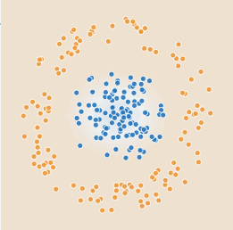

# Введение в искусственный интеллект

## Домашнее задание к Семинару 2
_Криволапов Антон_

### Урок 2. Три парадигмы искусственного интеллекта и подходы в них

## Классификация массивов данных при помощи нейронных сетей

| Набор                 | Параметры обучения | Какие фичи использованы | Сколько скрытых слоёв и нейронов в них использовано | Как быстро сошлась нейронная сеть при обучении | Характеристика областей классификации |Причины, почему произошло именно так, а не иначе
|:-:|:-|:-:|:-:|:-:|:-:|:-:|
| 1 | Learning rate=0.03 Activation=Tanh Regularization=None Regularization rate=0| $x_1^2$, $x_2^2$ | 1 слой, 1 нейрон| 6-7 эпох| Круг (овал) | 
||Activation

### Набор / Результат :
## 1

