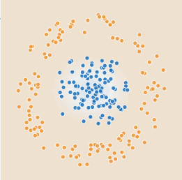

# Введение в искусственный интеллект

## Домашнее задание к Семинару 2
_Криволапов Антон_

### Урок 2. Три парадигмы искусственного интеллекта и подходы в них

## Классификация массивов данных при помощи нейронных сетей

| Набор               | Параметры обучения | Какие фичи использованы | Сколько скрытых слоёв и нейронов в них использовано | Как быстро сошлась нейронная сеть при обучении | Характеристика областей классификации |Причины, почему произошло именно так, а не иначе
|---------------------|--------------------|-------------------------|-----------------------------------------------------|------------------------------------------------|---------------------------------------|-----------------------------------------------------|
|  | $ x_{1} $          |
$ x_{1} $    
$$\left( \sum_{k=1}^n a_k b_k \right)^2 \leq \left( \sum_{k=1}^n a_k^2 \right) \left( \sum_{k=1}^n b_k^2 \right)$$ 