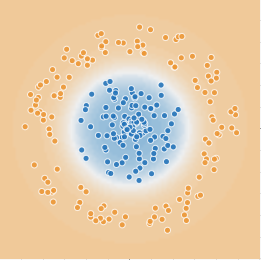

# Введение в искусственный интеллект

## Домашнее задание к Семинару 2
_Криволапов Антон_

### Урок 2. Три парадигмы искусственного интеллекта и подходы в них

## Классификация массивов данных при помощи нейронных сетей

| Набор | Параметры обучения                                                           | Какие фичи использованы | Сколько скрытых слоёв и нейронов в них использовано | Как быстро сошлась нейронная сеть при обучении | Характеристика областей классификации |Причины, почему произошло именно так, а не иначе
|:-----:|:-----------------------------------------------------------------------------|:-----------------------:|:-:|:----------------------------------------------:|:-------------------------------------:|:-:|
|   1   | Learning rate=0.03 Activation=Tanh Regularization=None Regularization rate=0 |    $x_1^2$, $x_2^2$     | 1 слой, 1 нейрон|                    6-7 эпох                    |                 Круг                  | Модель исходных данных укладываются в круг, поэтому функция квадрата координат максимально описывает эту модель
|   2   | Learning rate=0.03 Activation=Tanh Regularization=None Regularization rate=0 |        $x_1*x_2$        | 1 слой, 1 нейрон|                    3-4 эпох                    |              4 квадрата               | Система 4 квадратов лучше всего определяет это модель (перемножение координат) 
|   3   | Learning rate=0.03 Activation=Tanh Regularization=L1 Regularization rate=0   |       $x_1,x_2$        | 1 слой, 1 нейрон|                    3 эпохи                     |     2 области, отделенные линиями     | Задание отдельных координат $x_1$ и $x_2$ помогает системе провести разделительную линию между 2-мя группами точек

Четвертый набор мне не удалось решить. Я понимаю, что это 2 архимедовы спирали, но не понимаю, как мне настроить фичи. Возможно, нужно как-то задавать нейроны, которые выделяют эти спирали и линейные функции и настраивать веса к этим нейронам, не не понимаю, как.

### Набор / Результат :
### 1
 
### 2
 
### 3
 
